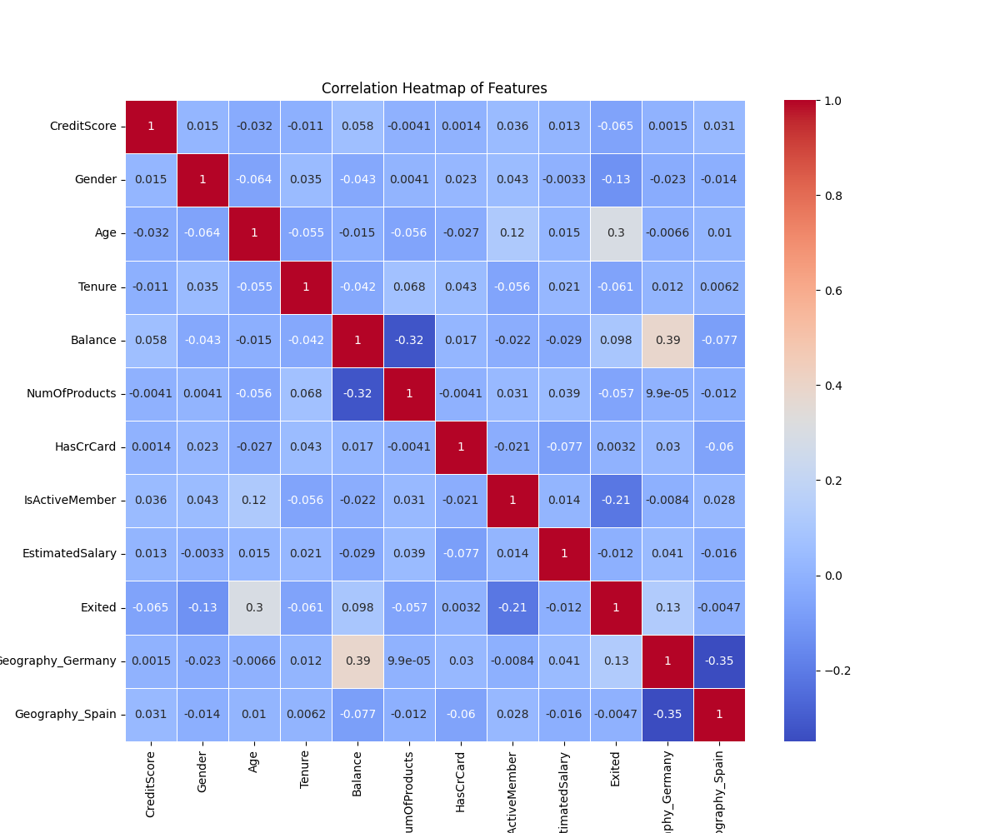
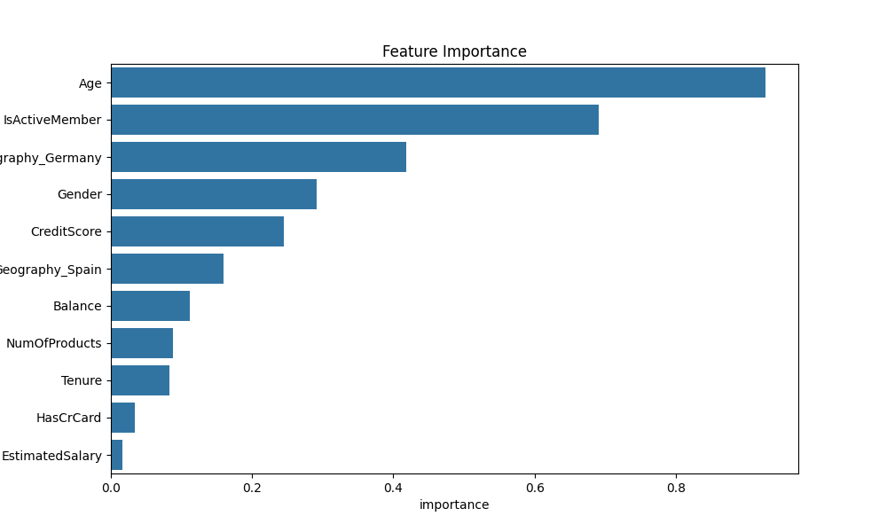
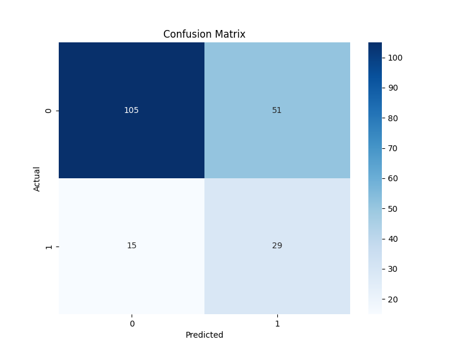

# Customer Churn Predictor

This tool predicts customer churn for a bank using machine learning techniques. It uses a logistic regression model trained on customer data to predict whether a customer is likely to leave the bank (churn) or not.

## Features

- Data preprocessing and feature engineering
- Logistic regression model training
- Model evaluation with accuracy score and classification report
- Visualizations including correlation heatmap, feature importance, and confusion matrix
- Interactive user interface for making predictions on new customer data

## Requirements

- Python 3.7+
- pandas
- numpy
- scikit-learn
- matplotlib
- seaborn

## Installation

1. Clone this repository:  git clone https://github.com/yourusername/customer-churn-predictor.git

2. Install the required packages:  pip install -r requirements.txt

## Usage

1. Ensure your customer data CSV file is in the same directory as the script.

2. Run the script:  python bank_churn_predictor.py

3. Follow the prompts to enter customer information for prediction.

## Data

The model expects a CSV file with the following columns:

- CreditScore
- Geography
- Gender
- Age
- Tenure
- Balance
- NumOfProducts
- HasCrCard
- IsActiveMember
- EstimatedSalary
- Exited (target variable)

## Model Performance

The logistic regression model achieves an accuracy of X% on the test set. Detailed performance metrics are printed when running the script.

## Visualizations

The script generates three visualizations:

1. `correlation_heatmap.png`: Shows the correlation between different features

2. `feature_importance.png`: Displays the importance of each feature in predicting churn

 
3. `confusion_matrix.png`: Illustrates the model's performance in terms of true positives, true negatives, false positives, and false negatives

